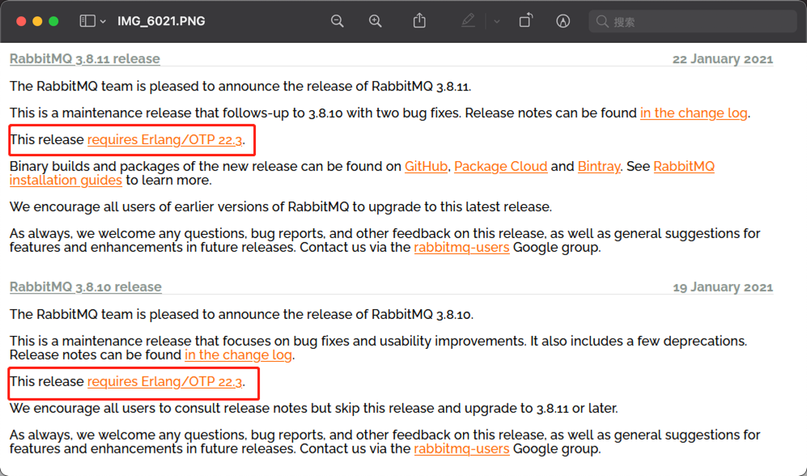
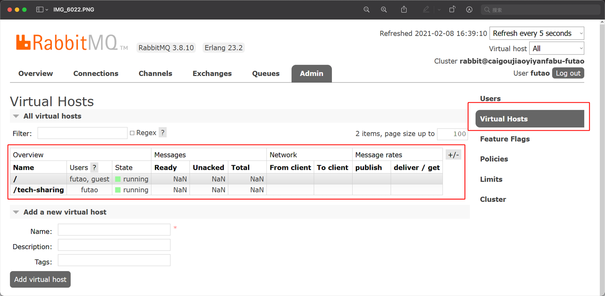

* JMS
* AMQP Advanced Queuing Protocol高级消息队列协议

### Why RabbitMQ

* 实现了AMQP协议，跨平台
* Erlang使得集群搭建非常简单
* RabbitMQ更稳定
* 其他：
    * 开源
    * 社区活跃

### 安装RabbitMQ以及依赖的环境

* 官网: [https://www.rabbitmq.com](https://www.rabbitmq.com)
* 依赖Erlang，需要现在本地安装好Erlang

### 信道 Channel

应用程序基于信道Channel与RabbitMQ通信，信道是建立在真实存在的TCP连接之上的，一旦TCP连接打开，应用程序就可以创建Channel信道。

* 为什么需要信道:
    * 因为对于系统来说，TCP连接的创建和销毁需要昂贵的开销
    * 且OS能提供的TCP连接本身就是有限的

### 基础概念

1. 队列
    * 推模式与拉模式
        * 推模式： `basic.consume`命令 RabbitMQ有消息就**实时**推送给应用程序。
        * 拉模式：`basic.get`命令 获取一条，应用程序**定时**拉取。(严重影响吞吐量)

### # 其他:

#### 1. 队列

* 如果两个程序同时监听了同一个Queue，那么消息是轮训的方式投递
* Queue中的每条消息都需要消费者basic.ack之后才会从队列中删除
    * 如果RabbitMQ在给某个应用程序发送消息之后没有收到basic.ack，那么将不再继续推送新的消息，之后收到上一条消息的basic.ack。（保护消费者，消费者限流）
* 拒绝消息：basic.reject，参数requeue，如果设置成了true，RabbitMQ会将该条消息重新放入队列中，否则直接删除。
    * 对于basic.reject且request为false的消息，为什么不直接签收，而要reject呢，因为签收表示消息符合客户端预期，且被正常处理消费，而basic.reject表示消息不符合客户端预期，被应用程序拒绝，对于这类消息，可以设置死信队列来接收，我们可以分析转发到死信队列的消息来分析系统运行状况，而不是直接忽略了这类消息。
* 匿名队列：如果在定义queue时没有指定队列名，RabbitMQ将随机分配一个队列名称，并且在queue.declare中返回。
* 队列属性:
    * exclusive: true私有队列，只有当前应用程序能够消费消息
    * auto-delete 当最后一个消费者取消订阅，队列就会自动移除
* 创建队列： queue.declare，如果尝试声明一个已经存在的队列，只要队列配置完全一致，RabbitMQ就什么都不做且返回成功，如果配置不一样，会返回失败。
    * 如果只是想检查队列是否存在，可以在queue.declare命令添加参数passive，如果存在会返回true，不存在会返回false。
* 消费者并不知道消息从谁发出来的，除非生产者在消息中添加了自己的信息。

#### 2. 交换机与路由键

* 交换机类型
    1. fanout 忽略路由键，将消息分发到与Exchange绑定的所有Queue
    2. direct  完全匹配路由键
    3. topic 路由键通配符
        1.  `#`匹配一个或多个
        2. `*` 只匹配一个词
    4. headers 允许匹配header而非路由键。几乎不用

#### 3. 虚拟主机vhost

* 每一个vhost可以拥有自己的Exchange，Queue和权限控制。可以设置某些用户拥有某些vhost的权限。
* 每个vhost之前不用担心命名冲突，是完全隔离的。

#### 4. 消息持久化0

> 默认情况下，RabbitMQ重启之后，里面定义的Exchange、Queue、Binding和Message都会消失。**除非**你将Exchange和Queue的durable属性设置为true。

* 为了保证消息在服务器重启之后依然存在，需要满足以下条件:
    * 在消息投递之前将消息的投递模式`delivery model`设置为持久`2`
    * 将消息投递到持久化Exchange
    * 消息到达持久化Queue
* 满足以上三点后，消息将被写入到本地磁盘文件中
* 【注意】：因为需要将消息持久化到磁盘，所以吞吐量会严重下降（最少降低10倍）。毕竟涉及到磁盘的读写，比直接操作内存要慢非常多。

* **不推荐使用事务的原因**： 使用MQ就是为了实现快速的异步调用，而使用事务会导致RabbitMQ以同步的方式等待消息确认，这会严重印象RabbitMQ的性能，也违背了使用MQ的初衷。所以不推荐在RabbitMQ中使用事务。代替方式是使用：发送方确认，confirm模式
    * confirm模式： 将Channel设置为Confirm模式之后，在该信道上发布的消息都将被指派一个唯一的ID号，从1开始。消息被正确投递到队列之后（如果队列是持久化队列，将在消息被写入磁盘之后），RabbitMQ将发送一个携带消息ID的ack消息给投递该条消息的生产者，通知该条消息已经被他正确可靠地投递到了队列，且该过程是异步的。如果消息在RabbitMQ内部出现了异常，那么RabbitMQ将发送一个nack消息通知生产者，或者有可能生产者什么消息都收不到（比如在消息投递到MQ的过程了发生了消息丢失了，或者MQ在通知消费者的过程中消息丢失了），对于这类问题，需要生产者处理。
* 