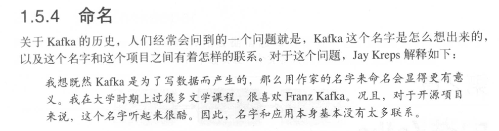
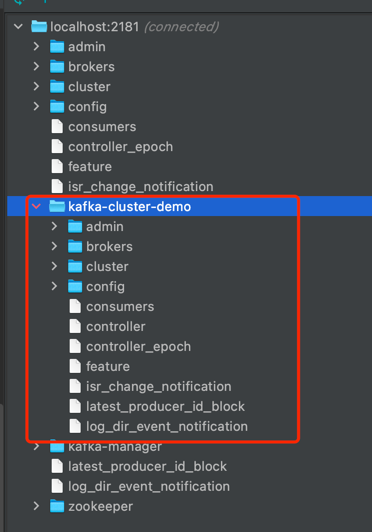
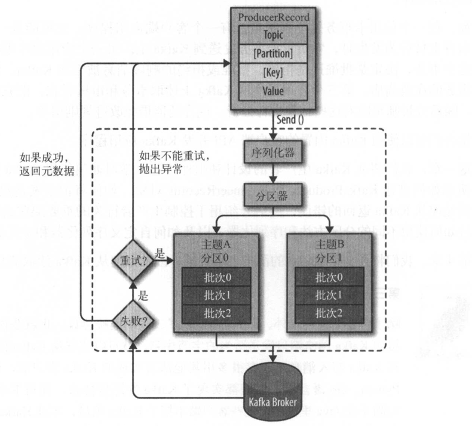
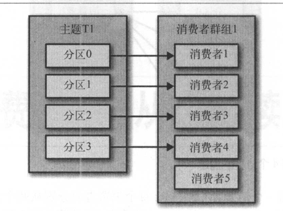
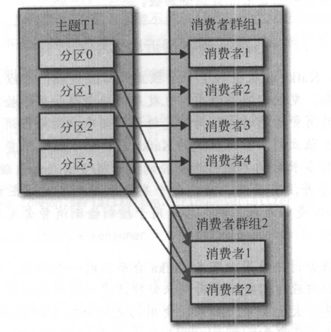

## # Kafka

### # 资源

- 监控
    - https://github.com/didi/Logi-KafkaManager
    - https://github.com/yahoo/CMAK

### # 资料

* 博客文章
    - [SpringBoot集成kafka全面实战](https://mp.weixin.qq.com/s/JvKPbvJ7q0ypqfF3ARBW7Q)

###                      # 

* kafka相比于其他MQ，除了支持持久化还支持流式处理

###                      # 

- 如果能在最开始接触这门技术时能看到这本书就好了。

### # 阅读笔记

##### 1.2.3 主题和分区

* 消息通过Topic进行分类，每个Topic又被划分为很多个Partition分区,消息被不断地追加到Partition，每个Partition的消息FIFO，但是Topic整体上并不保证FIFO。

##### 1.2.4 生产者与消费者

- 生产者Producer，生产者一般将消息均匀地投递到Topic所有的Partition，但是也可以实现自定义的分区规则，如使用Hash散列的方式，或者根据业务规则将消息投递到不同的Partition。
- 消费者Consumer可以订阅一个或者多个主题，并且根据偏移量来读取消息。
- 偏移量Offset，每个分区的偏移量记录了消息消费的位置，是一个不断递增的整数，并且被存储在ZK或者Kafka上。消费者断线重新连接也不会丢失。
- 消费者群组ConsumerGroup，多个消费者组成的消费者群组，群组保证一个分区只会被某一个消费者读取

##### 1.2.5 broker与集群

- 一个broker为一个Kafka服务器
-

多个broker组成集群。集群中有一个broker充当集群控制器的角色，一个Partition可以被分配给多个broker，主broker负责Producer和Consumer的读写，其他broker会Replication消息进行冗余。

### 2、安装Kafka

* 依赖:
    * JDK
        * Kafka是使用java开发的
    * Zookeeper
        * Kafka使用Zookeeper来保存broker的元数据和消费者信息
* http://kafka.apache.org/downloads
* 启动:
    1. 启动ZK：
        * `brew services start zookeeper`
        * `bin/zkServer.sh start conf/zoo.cfg`
    1. 启动Kafka：`bin/kafka-server-start.sh config/server.properties`

#### 集群

- 提示: kafka在使用zk的过程中一般都是多个集群连接到同一个ZK集群，为了避免配置被冲突和覆盖，最佳实践是在配置zk连接的时候指定chroot路径:
    - 配置方式: kafka: server.properties，zk连接地址: `zookeeper.connect=localhost:2181/kafka-cluster-demo`

### # 3. 生产者

* 发送消息的主要过程
  

*

如果没有指定ProducerRecord的分区，那么分区器会根据ProducerRecord来计算一个分区，随后该条消息会被添加到一个批次，同一个批次内的消息会被发送到同一个Topic的同一个Partition，有一个线程专门做这个事情。

- 如果消息成功写入Kafka，会返回消息的Topic，Partition和Offset。

#### 3.4 顺序保证

- 如果一切正常，生产者顺序投递，Kafka可以保证一个Partition内的消息是有序的，且消费者也会进行顺序消费。
- 如果`retries`不等于0并且`max.in.flight.requests.per.connection`
  大于1，那么可能存在前一个批次投递失败，后一个批次投递成功，随后第一个批次retry成功，导致消息的顺序错乱。所以对于需要严格保证消息有序的场景，需要把`max.in.flight.requests.per.connection`
  设置为1，即必须收到上一个响应之后才可以继续向Kafka发送消息，而retries的设置：可以是0也可以非0，进行重试。

#### 3.5 自定义序列化器

#### 3.6 分区

- 可以设置消息的ID，**且只能为字符串！**
    - 如果没有设置ID，即null且使用的是默认的分区器，那么Kafka会自动以轮询的方式将消息投递到Partition
    - 如果设置了ID
        - 默认的分区器：根据ID的散列值（Kafka可以保证同一个ID的散列值不变，即被投递到同一个Partition。但是如果分区数量发生了变化则不保证）
        - 自定义分区器： 自定义的规则

### 4. 消费者与消费者组

- 消费者用于消费Partition中的消息，当数据量很小的时候，单个消费者就OK了，但是随着业务的发展，生产者的速率不断提高，超过了消费者消费的速度，那么就会导致消息的堆积，对于这种情况应该如何处理呢。
  这个时候就可以使用消费者组，横向扩展，将多个消费者组成一个消费者组，提高消息的消费速度。
- 就像可以使用多个生产者生产消息，我们也可以使用多个消费者来消费消息。消费者群组内的每个消费者都可以消费一个或者多个Partition的消息，但是单个Partition的消息只会发送给一个消费者。
- 如果消费者的数量超过Partition的数量，那么会有消费者处于闲置状态。
  
- 试想这样一种场景：有两个系统都需要消费所有的消费，而不是部分消息，那么可以为每个系统设置一个消费者群组，每个消费者群组获取到的消息都是全量的。而每个消费者群组内的消息被分发给消费者群组内的不同消费者。
  

#### 4.6 偏移量与提交

- 不同于其他MQ，消息需要得到消费者的确认，那么Kafka是如何记录消息处理的位置呢？
- 偏移量，消费者通过向`_comsumer_offset`的特殊主体发送每个Partition的偏移量，消费者会从偏移量指定的位置开始消费Partition内的消息。
- 偏移量的提交方式：
    - 自动提交偏移量: `enable.auto.commit=true`,`auto.commit.interval.ms=5000`设置时间间隔
        - 问题：可能导致5S之内的消息被消费了但是没有通知到Partition导致消息重复消费。
    - 手动提交当前偏移量: `enable.auto.commit=false`
        - 同步提交: `kafkaConsumer.commitSync();`
            - broker响应之前会一直阻塞，但是如果提交失败了会进行重试，直到成功或者无法重试的异常。可靠性比较高。
        - 异步提交: `kafkaConsumer.commitAsync(new OffsetCommitCallback(){});`
            - 异步回调的方式通知结果，失败了不会进行重试。因为是异步的，可能后续新的偏移量已经提交了，如果重试的话会导致消息重复消费。
    - 最佳实践: 正常业务情况下使用异步提交，这样更快，不会产生阻塞，且就算其中一次失败了，可能后面的提交成功了也是OK的。但是在消费者下线之前使用同步提交，保证偏移量被可靠提交到broker。
    
#### 4.6.1    

### TODO

- 自定义分区器 
